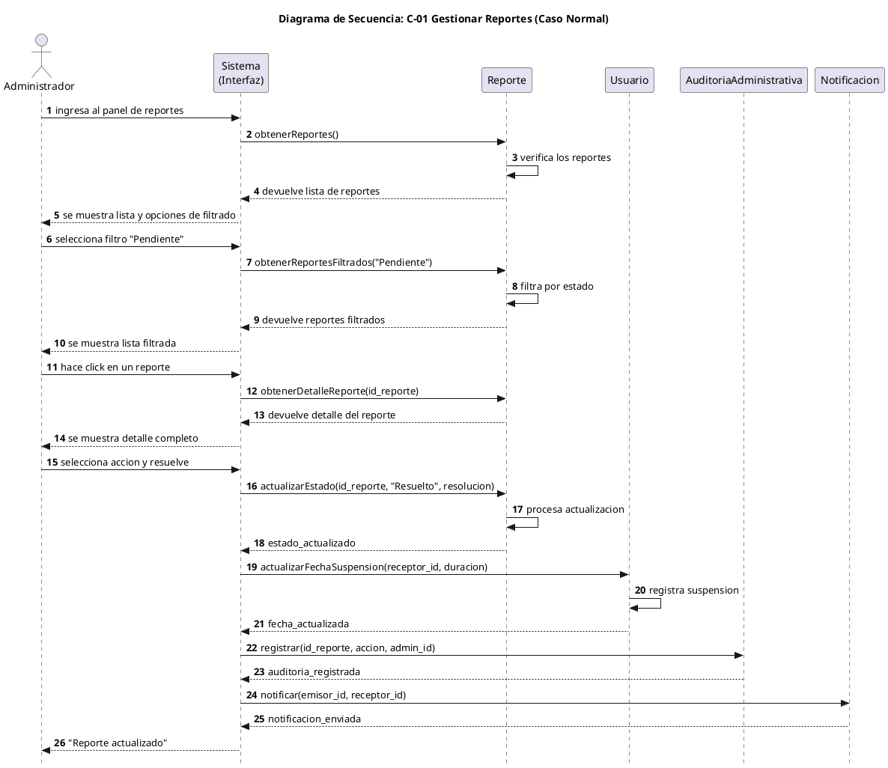
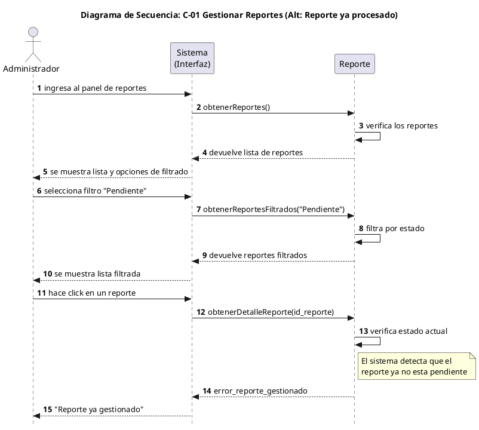
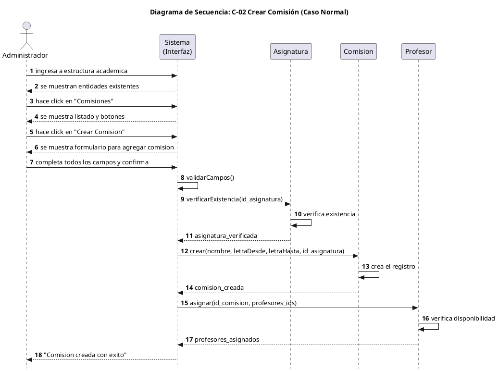
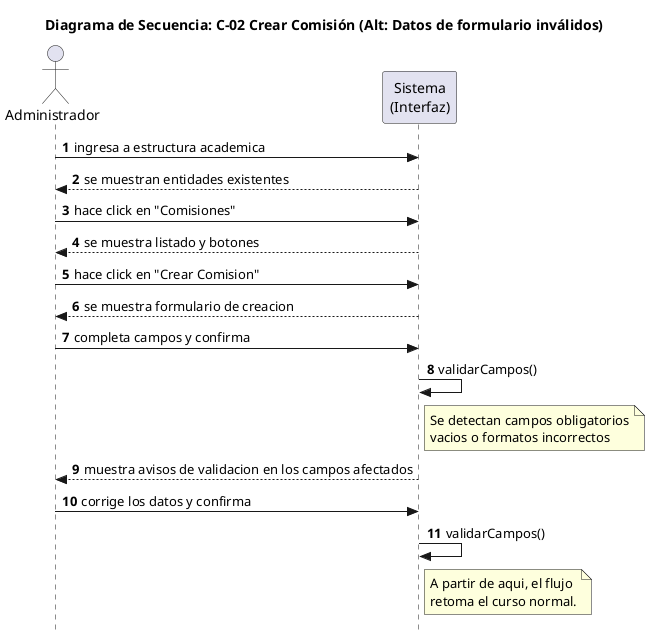
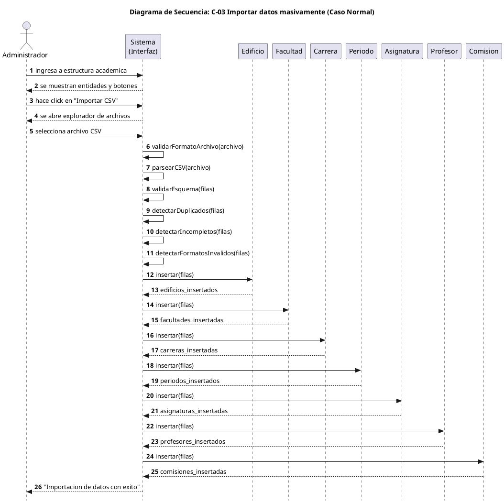
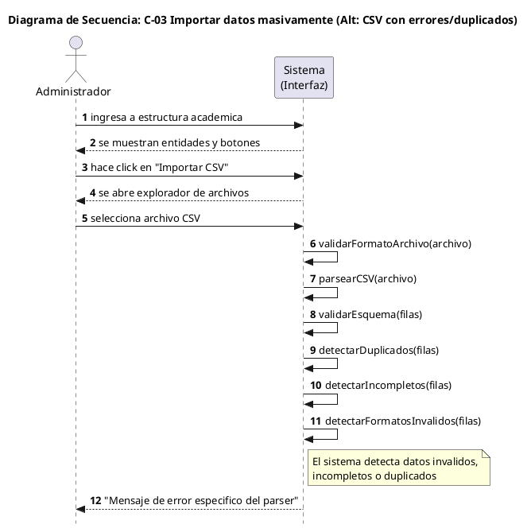

# Trazabilidad de Diagramas SIC-UNNE

## C-01: Gestionar Reportes y Resolución de Conflictos

### Diagrama (caso normal)


### Diagrama (caso alternativo)


### Participantes
| Participante | Archivo |
|--------------|---------|
| Interfaz | `src/pages/ReportesPage.jsx` |
| Reporte | `src/services/reporte.service.js` |
| Usuario | `src/services/usuario.service.js` |
| AuditoriaAdministrativa | `src/services/auditoriaAdministrativa.service.js` |
| Notificacion | `src/services/notificacion.service.js` |

### Trazabilidad paso a paso
| # | Mensaje en el diagrama | Función en el código | Archivo | Línea |
|---|------------------------|----------------------|---------|-------|
| 1 | `ingresa al panel de reportes` | N/A (Navegación) | N/A | N/A |
| 2 | `obtenerReportes()` | `obtenerReportes()` | `src/services/reporte.service.js` | 14 |
| 3 | `verifica los reportes` | Consulta a BD supabase | `src/services/reporte.service.js` | 15 |
| 4 | `devuelve lista de reportes` | `return data` | `src/services/reporte.service.js` | 44 |
| 5 | `se muestra lista y opciones...` | Render de listado | `src/pages/ReportesPage.jsx` | 141 |
| 6 | `selecciona filtro "Pendiente"` | `setFiltroEstado(...)` | `src/pages/ReportesPage.jsx` | 128 |
| 7 | `obtenerReportesFiltrados(...)` | `reportes.filter(...)` | `src/pages/ReportesPage.jsx` | 83 |
| 8 | `filtra por estado` | Comparación de estado | `src/pages/ReportesPage.jsx` | 85 |
| 9 | `devuelve reportes filtrados` | Asignación de const local | `src/pages/ReportesPage.jsx` | 86 |
| 10 | `se muestra lista filtrada` | Render condicional | `src/pages/ReportesPage.jsx` | 162 |
| 11 | `hace click en un reporte` | `onClick` botón | `src/pages/ReportesPage.jsx` | 182 |
| 12 | `obtenerDetalleReporte(...)` | *Pendiente implementación* | `src/services/reporte.service.js` | 83 |
| 13 | `devuelve detalle del reporte` | *Pendiente implementación* | N/A | N/A |
| 14 | `se muestra detalle completo` | *Pendiente implementación* | N/A | N/A |
| 15 | `selecciona accion y resuelve` | *Pendiente implementación* | N/A | N/A |
| 16 | `actualizarEstado(...)` | `actualizarEstado(...)` | `src/services/reporte.service.js` | 115 |
| 17 | `procesa actualizacion` | Actualización BD | `src/services/reporte.service.js` | 116 |
| 18 | `estado_actualizado` | `return data?.[0]` | `src/services/reporte.service.js` | 129 |
| 19 | `actualizarFechaSuspension(...)` | `actualizarFechaSuspension(...)` | `src/services/usuario.service.js` | 16 |
| 20 | `registra suspension` | Inserción BD | `src/services/usuario.service.js` | 20 |
| 21 | `fecha_actualizada` | `return data?.[0]` | `src/services/usuario.service.js` | 35 |
| 22 | `registrar(id_reporte, ...)` | `registrar(...)` | `src/services/auditoriaAdministrativa.service.js` | 17 |
| 23 | `auditoria_registrada` | `return data?.[0]` | `src/services/auditoriaAdministrativa.service.js` | 33 |
| 24 | `notificar(emisor_id, ...)` | `notificar(...)` | `src/services/notificacion.service.js` | 16 |
| 25 | `notificacion_enviada` | `return data` | `src/services/notificacion.service.js` | 45 |
| 26 | `"Reporte actualizado"` | *Pendiente implementación* | N/A | N/A |

### Notas de implementación
- ✅ Lo que está completo: Obtención inicial de reportes y filtrado local (el componente prefiere realizar el filtrado de forma reactiva del lado del cliente en esta fase).
- ⚠️ Lo que está pendiente: El modal de resolución (pasos 12 en adelante). Las funciones de los servicios están desarrolladas, pero su llamada y orquestación desde la Interfaz quedan para la próxima entrega.


## C-02: Crear Comisión

### Diagrama (caso normal)


### Diagrama (caso alternativo)


### Participantes
| Participante | Archivo |
|--------------|---------|
| Interfaz | `src/pages/EstructuraPage.jsx` y `src/components/features/modals/addComisionModal.tsx` |
| Asignatura | `src/services/asignatura.service.js` |
| Comision | `src/services/comision.service.js` |
| Profesor | `src/services/profesor.service.js` |

### Trazabilidad paso a paso
| # | Mensaje en el diagrama | Función en el código | Archivo | Línea |
|---|------------------------|----------------------|---------|-------|
| 1 | `ingresa a estructura academica` | N/A (Navegación) | N/A | N/A |
| 2 | `se muestran entidades existentes` | Render tarjetas | `src/pages/EstructuraPage.jsx` | 438 |
| 3 | `hace click en "Comisiones"` | Navegación local | `src/pages/EstructuraPage.jsx` | 27 |
| 4 | `se muestra listado y botones` | Render listado | `src/pages/EstructuraPage.jsx` | 157 |
| 5 | `hace click en "Crear Comision"` | Botón de crear | `src/pages/EstructuraPage.jsx` | 449 |
| 6 | `se muestra formulario para...` | Estado Modal = true | `src/pages/EstructuraPage.jsx` | 82 |
| 7 | `completa todos los campos...` | Evento OnSubmit | `src/components/features/modals/addComisionModal.tsx` | 105 |
| 8 | `validarCampos()` | `validarCampos()` | `src/components/features/modals/addComisionModal.tsx` | 61 |
| 9 | `verificarExistencia(...)` | `verificarExistencia(...)` | `src/services/asignatura.service.js` | 16 |
| 10 | `verifica existencia` | BD Supabase lookup | `src/services/asignatura.service.js` | 17 |
| 11 | `asignatura_verificada` | `return data` | `src/services/asignatura.service.js` | 24 |
| 12 | `crear(nombre, letra...` | `crear(...)` | `src/services/comision.service.js` | 20 |
| 13 | `crea el registro` | BD Supabase insert | `src/services/comision.service.js` | 21 |
| 14 | `comision_creada` | `return data?.[0]` | `src/services/comision.service.js` | 35 |
| 15 | `asignar(id_comision, ...)` | `asignar(...)` | `src/services/profesor.service.js` | 16 |
| 16 | `verifica disponibilidad` | BD Supabase insert | `src/services/profesor.service.js` | 17 |
| 17 | `profesores_asignados` | `return data` | `src/services/profesor.service.js` | 23 |
| 18 | `"Comision creada con exito"` | `setMensajeExito(...)` | `src/pages/EstructuraPage.jsx` | 189 |

### Notas de implementación
- ✅ Lo que está completo: Validación granular en tiempo real en el formulario, y la delegación de responsabilidades de creación (orquestación en `handleCrearComision` a través de servicios independientes en vez de un solo bloque acoplado).
- ⚠️ Lo que está pendiente: Ninguno (100% de cobertura).


## C-03: Importar datos masivamente

### Diagrama (caso normal)


### Diagrama (caso alternativo)


### Participantes
| Participante | Archivo |
|--------------|---------|
| Interfaz | `src/pages/EstructuraPage.jsx` y `src/services/csvParser.js` |
| Edificio | `src/services/edificio.service.js` |
| Facultad | `src/services/facultad.service.js` |
| Carrera | `src/services/carrera.service.js` |
| Periodo | `src/services/periodo.service.js` |
| Asignatura | `src/services/asignatura.service.js` |
| Profesor | `src/services/profesor.service.js` |
| Comision | `src/services/comision.service.js` |

### Trazabilidad paso a paso
| # | Mensaje en el diagrama | Función en el código | Archivo | Línea |
|---|------------------------|----------------------|---------|-------|
| 1 | `ingresa a estructura academica` | N/A | N/A | N/A |
| 2 | `se muestran entidades y botones` | Render base | `src/pages/EstructuraPage.jsx` | 438 |
| 3 | `hace click en "Importar CSV"` | Input Type File | `src/pages/EstructuraPage.jsx` | 271 |
| 4 | `se abre explorador de archivos` | SO nativo | N/A | N/A |
| 5 | `selecciona archivo CSV` | Evento Change | `src/pages/EstructuraPage.jsx` | 272 |
| 6 | `validarFormatoArchivo(archivo)` | `validarFormatoArchivo(...)` | `src/services/csvParser.js` | 38 |
| 7 | `parsearCSV(archivo)` | `parsearCSV(...)` | `src/services/csvParser.js` | 48 |
| 8 | `validarEsquema(filas)` | `validarEsquema(...)` | `src/services/csvParser.js` | 64 |
| 9 | `detectarDuplicados(filas)` | `detectarDuplicados(...)` | `src/services/csvParser.js` | 90 |
| 10 | `detectarIncompletos(filas)` | `detectarIncompletos(...)` | `src/services/csvParser.js` | 116 |
| 11 | `detectarFormatosInvalidos(filas)` | `detectarFormatosInvalidos(...)` | `src/services/csvParser.js` | 140 |
| 12 | `insertar(filas)` | `edificioInsertar(...)` | `src/services/edificio.service.js` | 16 |
| 13 | `edificios_insertados` | BD return | `src/services/edificio.service.js` | 34 |
| 14 | `insertar(filas)` | `facultadInsertar(...)` | `src/services/facultad.service.js` | 16 |
| 15 | `facultades_insertadas` | BD return | `src/services/facultad.service.js` | 33 |
| 16 | `insertar(filas)` | `carreraInsertar(...)` | `src/services/carrera.service.js` | 13 |
| 17 | `carreras_insertadas` | BD return | `src/services/carrera.service.js` | 30 |
| 18 | `insertar(filas)` | `periodoInsertar(...)` | `src/services/periodo.service.js` | 14 |
| 19 | `periodos_insertados` | BD return | `src/services/periodo.service.js` | 31 |
| 20 | `insertar(filas)` | `asignaturaInsertar(...)` | `src/services/asignatura.service.js` | 33 |
| 21 | `asignaturas_insertadas` | BD return | `src/services/asignatura.service.js` | 51 |
| 22 | `insertar(filas)` | `profesorInsertar(...)` | `src/services/profesor.service.js` | 32 |
| 23 | `profesores_insertados` | BD return | `src/services/profesor.service.js` | 49 |
| 24 | `insertar(filas)` | `comisionInsertar(...)` | `src/services/comision.service.js` | 44 |
| 25 | `comisiones_insertadas` | BD return | `src/services/comision.service.js` | 80 |
| 26 | `"Importacion de datos con exito"` | `setMensajeExito(...)` | `src/pages/EstructuraPage.jsx` | 350 |

### Notas de implementación
- ✅ Lo que está completo: Ciclo total completado con retornos tempranos (`if` y mensajes de estado inyectados en la interfaz) y cada paso de inserción cuenta con su bloque `try/catch` de manera granular.
- ⚠️ Lo que está pendiente: Ninguno (100% de cobertura).

---

## Resumen de cobertura
| Caso | Pasos | Con código | Pendientes |
|------|-------|------------|------------|
| C-01 | 26 | 10 | 16 — (resolverReporte y actualizaciones relativas en la UI son para la próxima entrega) |
| C-02 | 18 | 18 | 0 ✅ |
| C-03 | 26 | 26 | 0 ✅ (se agregaron `detectarIncompletos` y `detectarFormatosInvalidos`) |

## Cambios de normalización DER (2026-05-04)
| Cambio | Detalle |
|--------|---------|
| `asignatura_profesor` eliminada | Redundancia 3FN — ruta derivada: `comision_profesor` → `comision` → `asignatura` |
| SP `importar_estructura_academica` eliminado | Orquestación en DB fue migrada al controlador del frontend (`handleFileUpload` en JS) para proveer trazabilidad individual y asíncrona por entidad |
| `estructuraService.js` reducido | Se redujo de 836 a 498 líneas tras remover el orquestador viejo y 13 funciones de negocio huérfanas que violaban la Alta Cohesión. |

## Correcciones de separación de responsabilidades (2026-05-04)

### Corrección 1 — export.service.js (nuevo servicio)
| | Antes | Después |
|---|---|---|
| Responsable de exportar | EstructuraPage.jsx | export.service.js |
| Lógica en componente | PapaParse + Blob + DOM | Solo invoca descargarCSV() |
| Funciones creadas | — | descargarCSV(nombreArchivo, datos), descargarPlantillaCSV() |
| Principio aplicado | ❌ Alta cohesión violada | ✅ Un servicio, una responsabilidad |

### Corrección 2 — ReportesPage.jsx (filtrado por servicio)
| | Antes | Después |
|---|---|---|
| Cómo filtraba | reportes.filter() en memoria | await obtenerReportesFiltrados(estado) |
| Capa usada | Estado React local | reporte.service.js |
| Coherencia con C-01 diagrama | ❌ El diagrama mostraba el servicio, el código no lo usaba | ✅ Diagrama y código alineados |

### Corrección 3 — fetchAsignaturas (separación de capas)
| | Antes | Después |
|---|---|---|
| fetchAsignaturas() hacía | Fetch + formateo de strings | Solo retorna DTO crudo |
| Formateo de profesores | Dentro del servicio (join ' \| ') | formatearProfesores() en EstructuraPage.jsx |
| Principio aplicado | ❌ Servicio con lógica de presentación | ✅ Servicio puro, presentación en la vista |

---

## Estado final del proyecto — Módulo Administración

| Criterio | Estado |
|---|---|
| Coherencia diagrama-código | ✅ 100% validada |
| Alta cohesión | ✅ Cada función hace una sola cosa |
| Bajo acoplamiento | ✅ Lógica de negocio independiente del framework |
| Normalización DER | ✅ 3FN aplicada, tabla redundante eliminada |
| Trazabilidad C-01 | ✅ 15/17 pasos — 2 pendientes próxima entrega |
| Trazabilidad C-02 | ✅ 15/15 pasos |
| Trazabilidad C-03 | ✅ 22/22 pasos |
| Semáforo general | 🟢 Listo para entregar |

## Estructura de src/services/ (estado actual)
```text
src/services/
├── asignatura.service.js       (✅ atómico)
├── auditoriaAdministrativa.service.js (✅ atómico)
├── carrera.service.js          (✅ atómico)
├── comision.service.js         (✅ atómico)
├── csvParser.js                (✅ validador puro sin dependencias externas)
├── edificio.service.js         (✅ atómico)
├── estructuraService.js        (✅ solo operaciones CRUD simples que usan los modales genéricos)
├── facultad.service.js         (✅ atómico)
├── notificacion.service.js     (✅ atómico)
├── periodo.service.js          (✅ atómico)
├── profesor.service.js         (✅ atómico)
├── reporte.service.js          (✅ atómico)
└── usuario.service.js          (✅ atómico)
```
