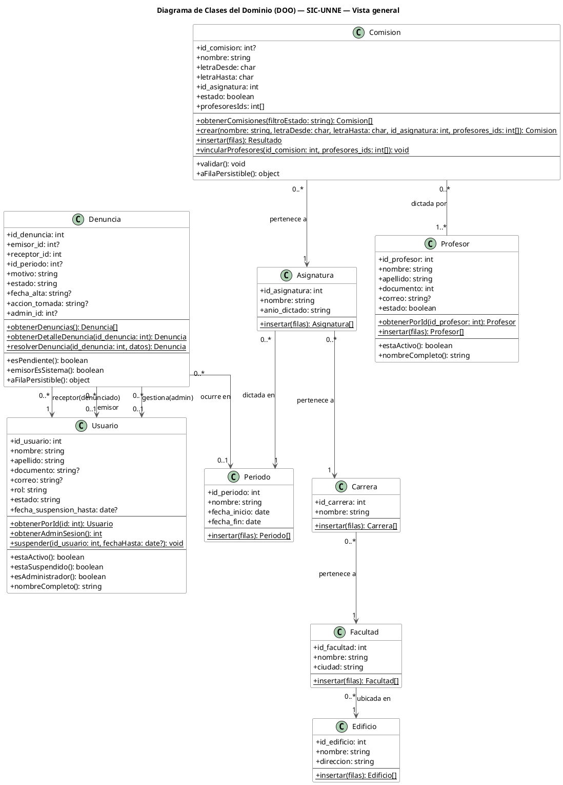
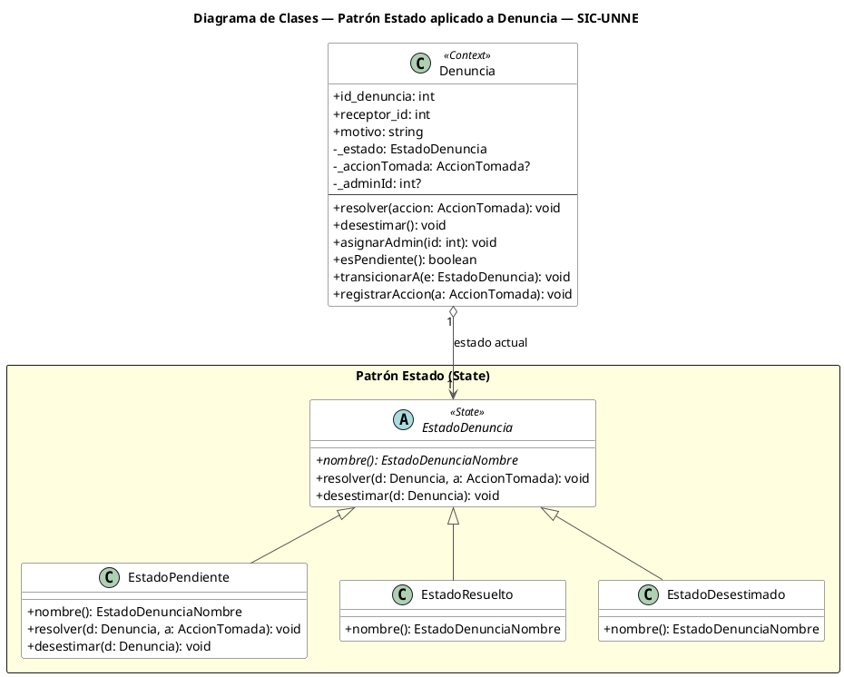

# Diagrama de Clases del Dominio (DOO) — SIC-UNNE

Este documento contiene **dos** diagramas de clases, tal como pide la cátedra:

1. **Diagrama 1 — Vista general (sin patrón):** el modelo de dominio completo de los
   objetos que la aplicación crea y usa para llevar adelante las funcionalidades de esta
   entrega (Gestión de Denuncias y Estructura Académica). `Denuncia` aparece con un
   atributo simple `estado: string`.
2. **Diagrama 2 — Vista con el patrón de diseño (Estado):** la misma `Denuncia`, pero
   ampliada para mostrar el **patrón Estado** que gobierna su ciclo de vida.

> **DOO puro:** ambos diagramas contienen **únicamente entidades de dominio**. No hay
> controladores (API Routes), ni servicios de aplicación, ni repositorios, ni detalles de
> Supabase. Esas piezas existen en el código (separación en capas) pero **no son objetos
> del dominio**, por eso no se dibujan.

---

## Criterio de consistencia (clases ↔ secuencias ↔ código)

Los métodos del **Diagrama 1** son **exactamente** los mensajes que cada objeto recibe en
los **diagramas de secuencia aprobados**, y cada uno corresponde a una función real del
código (ver la *Tabla de trazabilidad* al final):

- **Métodos `{static}` (subrayados, arriba del separador)** = operaciones de clase que
  aparecen en las secuencias (`obtenerDenuncias`, `obtenerComisiones`, `crear`, `insertar`,
  `obtenerPorId`, `suspender`, …). Se implementan en la capa de aplicación/persistencia
  (servicios cliente, API Routes y repositorios), que el diagrama DOO no dibuja por ser
  infraestructura.
- **Métodos de instancia (debajo del separador)** = comportamiento propio de la entidad
  sobre sus datos (`validar`, `esPendiente`, `estaActivo`, `nombreCompleto`, …). Están en
  las clases de `src/domain/`.

Así, cada mensaje de un **diagrama de secuencia** cae sobre un método declarado en la
**clase** correspondiente y, a su vez, sobre un método real del **código**.

---

## Diagrama 1 — Vista general del dominio (sin patrón)



**Lectura del diagrama 1.** Todas las clases quedan conectadas en un único grafo: la
jerarquía académica baja de `Edificio` a `Comisión`, `Comisión` se relaciona N:M con
`Profesor`, y el área de `Denuncia`/`Usuario` se enlaza con la jerarquía académica a través
de **`Periodo`** (tanto `Asignatura` como `Denuncia` ocurren en un `Periodo`). No hay
clases aisladas.

---

## Diagrama 2 — Vista con el patrón de diseño: Estado (State)

Diagrama **específico del patrón elegido**. Amplía la `Denuncia` del diagrama 1
reemplazando su atributo `estado: string` por una colaboración con la jerarquía
`EstadoDenuncia` (patrón Estado de GoF).



### Breve justificación del patrón Estado

**Problema.** Una `Denuncia` tiene un ciclo de vida: nace `Pendiente` y pasa a `Resuelto`
o `Desestimado` (terminales). La regla *"una denuncia ya procesada no puede volver a
resolverse"* estaba dispersa en condicionales `if`, fácil de olvidar o duplicar.

**Solución.** Cada estado es una clase que decide qué transiciones son válidas. `Denuncia`
(el *Contexto*) **delega** en su objeto-estado actual. La clase base `EstadoDenuncia`
rechaza por defecto toda transición (lanza `DenunciaYaProcesadaError` → 409); solo
`EstadoPendiente` sobrescribe `resolver()` y `desestimar()` para permitirlas. Así, agregar
o cambiar reglas de transición no toca a `Denuncia`: se modifica el estado correspondiente
(principio Abierto/Cerrado).

**Implementación.** `src/domain/denuncia/Denuncia.ts` (contexto) y
`src/domain/denuncia/estados/` (`EstadoDenuncia.ts` base, `EstadoPendiente.ts`,
`EstadoResuelto.ts`, `EstadoDesestimado.ts`, e `index.ts` con la fábrica `crearEstado`).

---

## Tabla de trazabilidad (para la defensa)

Cómo leer esta tabla: la columna izquierda es el **nombre del método tal como aparece en el
diagrama de secuencia y en el diagrama de clases** (son idénticos). La columna derecha dice
**en qué archivo del código está ese método**, para que al rendir puedas abrir el diagrama de
secuencia, señalar un mensaje y mostrar exactamente la línea de código que lo implementa.

| Método (secuencia = diagrama de clases) | Archivo del código donde está |
|---|---|
| `Denuncia.obtenerDenuncias()` | `src/services/denuncias/denuncia.service.js` |
| `Denuncia.obtenerDetalleDenuncia(id)` | `src/services/denuncias/denuncia.service.js` |
| `Denuncia.resolverDenuncia(id, datos)` | `denuncia.service.js` → `api/denuncias/[id].js` → `ServicioResolucionDenuncia.resolver()` |
| `Usuario.obtenerPorId(id)` | `ServicioConsultaUsuario.obtenerPorId` → `UsuarioRepositorio.obtenerPorId` |
| `Usuario.obtenerAdminSesion()` | `ServicioConsultaUsuario.obtenerAdminSesion` |
| `Usuario.suspender(id, fechaHasta)` | `UsuarioRepositorio.suspender` → **SP `sp_suspender_usuario`** |
| `Comision.obtenerComisiones(filtro)` | `src/services/academico/comision.service.js` → `ServicioComision.listar` |
| `Comision.crear(...)` | `comision.service.js` → `ServicioComision.crear` → `ComisionRepositorio.crear` |
| `Comision.insertar(filas)` | `comision.service.js` → `ServicioComision.importarMasivo` |
| `Comision.vincularProfesores(id, ids)` | `ComisionRepositorio.vincularProfesores` |
| `Profesor.obtenerPorId(id)` | `ProfesorRepositorio.obtenerPorId` |
| `Profesor.insertar(filas)` | `src/services/academico/profesor.service.js` |
| `Edificio/Facultad/Carrera/Periodo/Asignatura.insertar(filas)` | `src/services/academico/<entidad>.service.js` |
| `csvParser.validarFormatoArchivo / parsearCSV / validarEsquema / detectarDuplicados / detectarIncompletos / detectarFormatosInvalidos` | `src/services/utils/csvParser.js` |

Métodos de instancia (debajo del separador en cada clase):

| Método | Archivo |
|---|---|
| `Denuncia.resolver / desestimar / esPendiente / emisorEsSistema / aFilaPersistible` | `src/domain/denuncia/Denuncia.ts` |
| `Comision.validar / aFilaPersistible` | `src/domain/comision/Comision.ts` |
| `Usuario.estaActivo / estaSuspendido / esAdministrador / nombreCompleto` | `src/domain/usuario/Usuario.ts` |
| `Profesor.estaActivo / nombreCompleto` | `src/domain/profesor/Profesor.ts` |

---

## Tipos auxiliares referenciados

```text
EstadoDenunciaNombre = "Pendiente" | "Resuelto" | "Desestimado"
AccionTomada         = "Enviar aviso" | "Suspender Temporalmente" | "Suspender Indefinidamente"
```
