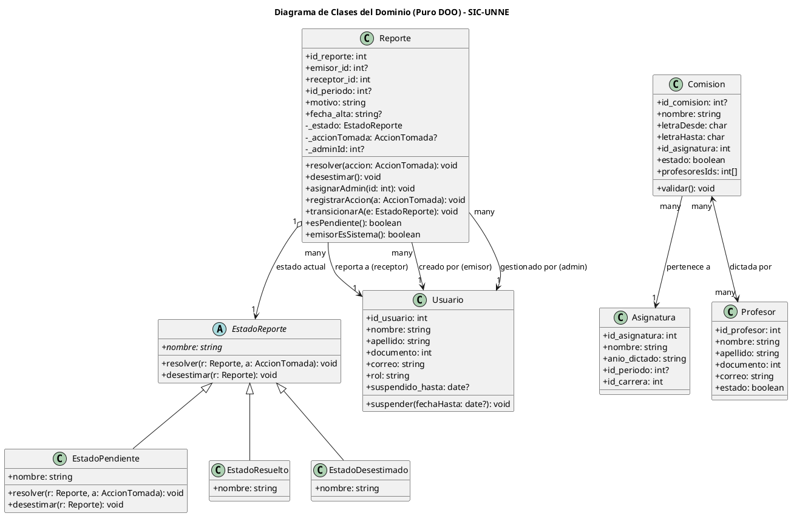

## 1. Diagrama de Clases del DOMINIO (Puro DOO - Vista Conceptual)

> **Esta vista es independiente de la arquitectura y la persistencia.** Contiene **únicamente las entidades del dominio** y sus relaciones de colaboración conceptuales, tal como exige la cátedra para el modelado puramente DOO (sin controladores, servicios de aplicación, repositorios ni detalles tecnológicos).

1. **Diagrama de Clases del Dominio (Sección 1):** Es la vista conceptual abstracta (DOO Puro). Representa las entidades de negocio, sus atributos y sus colaboraciones conceptuales directas (por ejemplo, que un `Reporte` se asocia con un `Usuario` emisor y receptor, y delega su comportamiento de estado en un `EstadoReporte`). No sabe nada de bases de datos, APIs de Next.js, ni de cómo se persisten los objetos.