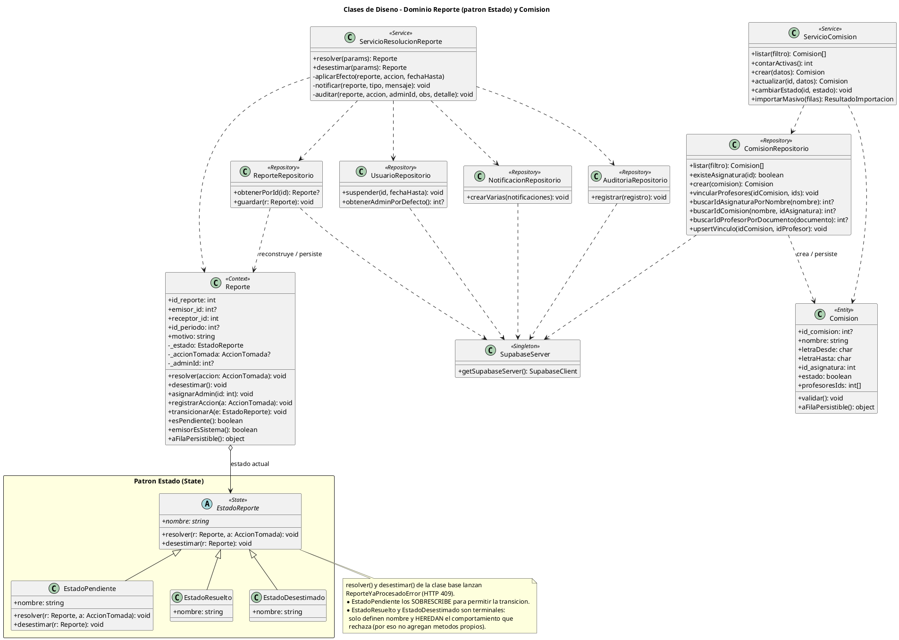

# Diagrama de Clases del Dominio — SIC-UNNE

Este documento contiene dos vistas complementarias:

1. **Diagrama de Clases de Diseño** (sección 0): las clases reales del código `src/domain/`, con sus **métodos** y la jerarquía del **único patrón de diseño implementado: Estado**. Es la vista que demuestra el Diseño Orientado a Objetos.
2. **Diagrama de Clases de Datos / Entidades** (secciones 1-2): el mapeo de las tablas (atributos), útil como referencia del modelo persistente.

Se presentan en **Mermaid** (visualización nativa en GitHub/VSCode) y **PlantUML** (sintaxis académica estándar).

---

## 0. Diagrama de Clases de DISEÑO (dominio Reporte + Comisión)

> Esta es la vista que refleja el código y el **único patrón de diseño implementado (Estado)**, marcado con un recuadro. Los patrones **Estrategia** y **Observador** quedan como **candidatos documentados** (se describe dónde *podrían* aplicarse) en `docs/uml/patrones_diseno.md`; **no** están en el código.

