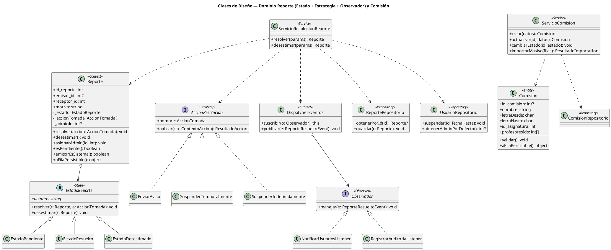
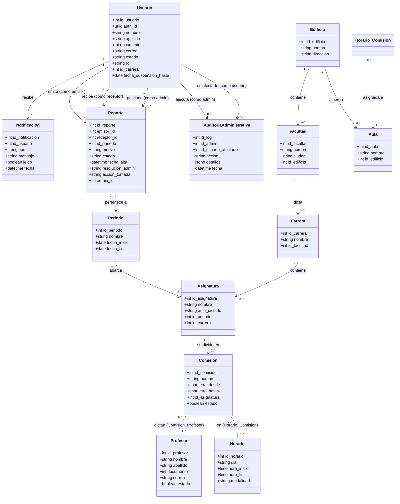
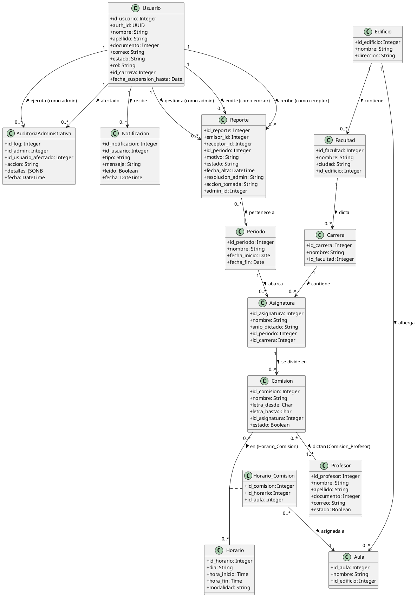

# Diagrama de Clases del Dominio — SIC-UNNE

Este documento contiene dos vistas complementarias:

1. **Diagrama de Clases de Diseño** (sección 0): las clases reales del código `src/domain/`, con sus **métodos** y las jerarquías de los patrones Estado, Estrategia y Observador. Es la vista que demuestra el Diseño Orientado a Objetos.
2. **Diagrama de Clases de Datos / Entidades** (secciones 1-2): el mapeo de las tablas (atributos), útil como referencia del modelo persistente.

Se presentan en **Mermaid** (visualización nativa en GitHub/VSCode) y **PlantUML** (sintaxis académica estándar).

---

## 0. Diagrama de Clases de DISEÑO (dominio Reporte + Comisión)

> Esta es la vista que refleja el código y los **3 patrones de diseño**. Ver `docs/uml/patrones_diseno.md` para el detalle de cada patrón.

---

## 1. Diagrama de Clases de DATOS / Entidades (modelo persistente)

> Vista de referencia: tablas y atributos. (Mantiene la versión previa del documento.)

---

## 1. Representación Gráfica (Mermaid)

---

## 2. Definición en PlantUML

Puedes copiar y pegar este bloque de código directamente en [PlantText](https://www.planttext.com/) o en tu plugin de VSCode para generar el diagrama en PNG o SVG.

