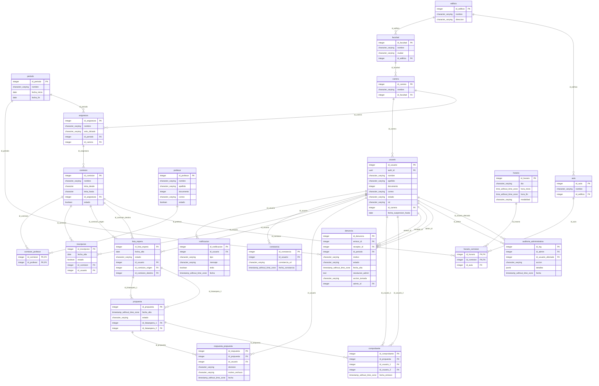

# Diagrama Físico de Base de Datos — SIC-UNNE

Este documento contiene la representación visual en formato **Mermaid ER** de la base de datos física del sistema (SIC-UNNE). Este diagrama detalla los tipos de datos exactos, las claves primarias (PK) y claves foráneas (FK) tal como están definidas en tu esquema físico de PostgreSQL.

Puedes copiar este código Mermaid y visualizarlo en Notion, GitHub, VSCode, o renderizarlo en [Mermaid Live Editor](https://mermaid.live).

---

## Modelo Entidad-Relación Físico (Mermaid)

