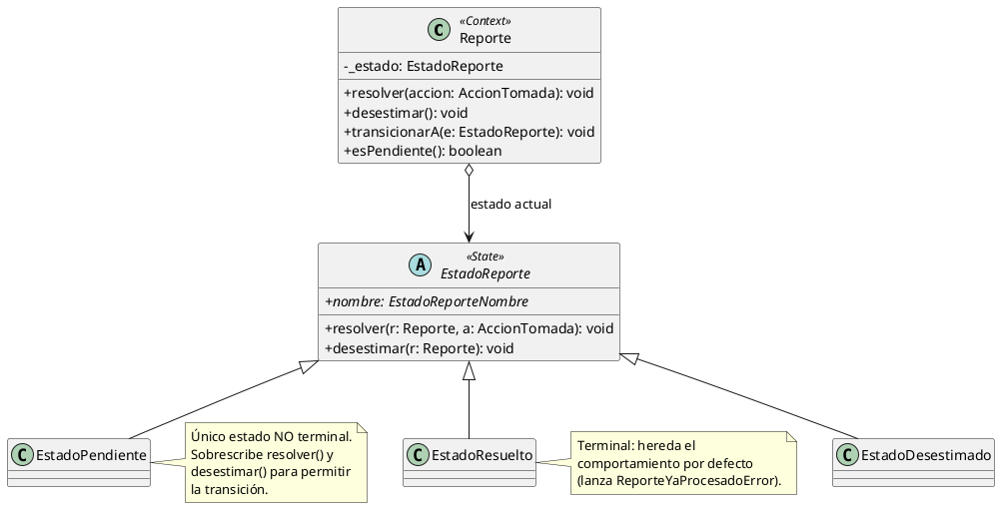
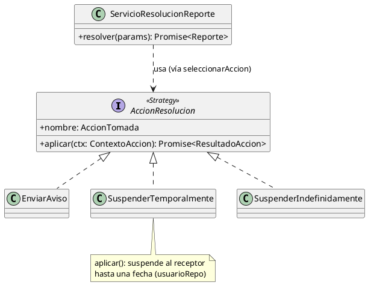
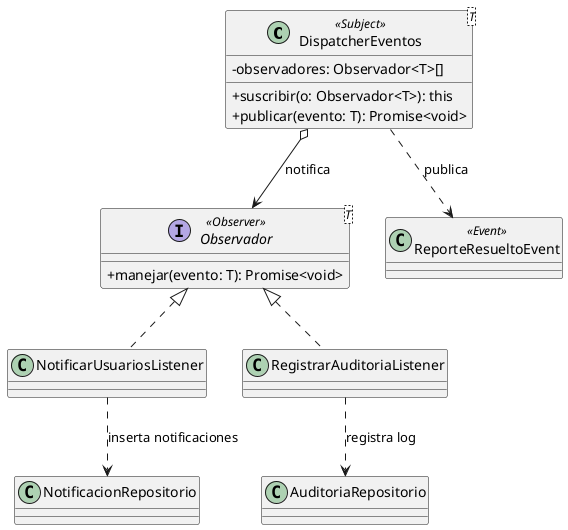

# Patrones de Diseño Aplicados — SIC-UNNE

Este documento describe la **arquitectura** y los **patrones de diseño** del módulo de Administración del SIC-UNNE, tal como están implementados en el código (`src/`). Todos los patrones pertenecen al catálogo visto en **Ingeniería del Software II**.

---

## 1. Arquitectura: Cliente-Servidor en Capas (Layered)

Se abandonó el enfoque BaaS (acceso directo a Supabase desde el cliente). El sistema se organiza en capas con responsabilidades separadas:

| Capa | Carpeta | Responsabilidad |
|---|---|---|
| **Presentación** | `src/app`, `src/components`, `src/pages/*.jsx` | UI en React. Captura datos y muestra resultados. |
| **Servicios HTTP (cliente)** | `src/services/` | Cliente HTTP puro (`fetch`). No contiene lógica de negocio. |
| **Controladores (API)** | `src/pages/api/` | API Routes de Next.js. Validan el transporte y delegan en el dominio. |
| **Dominio** | `src/domain/` | Clases de negocio con comportamiento. Aquí viven los 3 patrones. |
| **Infraestructura / Repositorios** | `src/infrastructure/` | Aíslan el acceso a Supabase del dominio. |
| **Datos** | Supabase (PostgreSQL) | Motor de base de datos. Ya no se usa como BaaS. |

```plantuml
@startuml
skinparam componentStyle rectangle
skinparam shadowing false

package "Presentación" {
  [ReportesPage / EstructuraPage]
}
package "Servicios HTTP (cliente)" {
  [reporte.service / comision.service]
}
package "Controladores (API Routes)" {
  [/api/reportes/[id]]
  [/api/comisiones]
}
package "Dominio" {
  [ServicioResolucionReporte]
  [ServicioComision]
}
package "Infraestructura" {
  [Repositorios]
  [supabaseServer (Singleton)]
}
database "Supabase\nPostgreSQL" as DB

[ReportesPage / EstructuraPage] --> [reporte.service / comision.service]
[reporte.service / comision.service] ..> [/api/reportes/[id]] : HTTP fetch
[/api/reportes/[id]] --> [ServicioResolucionReporte]
[/api/comisiones] --> [ServicioComision]
[ServicioResolucionReporte] --> [Repositorios]
[ServicioComision] --> [Repositorios]
[Repositorios] --> [supabaseServer (Singleton)]
[supabaseServer (Singleton)] --> DB
@enduml
```

Los **3 patrones de diseño** se concentran en el dominio de la funcionalidad principal — **Gestión de Reportes y Resolución de Conflictos (C-01)** — porque es donde el problema lo justifica genuinamente.

---

## 2. Patrón ESTADO (State)

### Problema
Un reporte tiene un **ciclo de vida**: nace `Pendiente` y puede pasar a `Resuelto` o `Desestimado`, que son estados **terminales**. La regla "un reporte ya procesado no puede volver a resolverse" estaba implementada con `if`s dispersos, fácil de olvidar y duplicar.

### Solución
Cada estado es una clase que decide qué transiciones son válidas. El `Reporte` (contexto) delega en su estado actual. Intentar una transición inválida lanza `ReporteYaProcesadoError` (HTTP 409).

### Diagrama


### Archivos
`src/domain/reporte/estados/` → `EstadoReporte.ts` (base), `EstadoPendiente.ts`, `EstadoResuelto.ts`, `EstadoDesestimado.ts`, `index.ts` (fábrica `crearEstado`).

---

## 3. Patrón ESTRATEGIA (Strategy)

### Problema
Al resolver un reporte, el administrador elige una de **3 acciones** con efectos distintos: `Enviar aviso`, `Suspender Temporalmente`, `Suspender Indefinidamente`. Resolverlo con `if/else` mezcla los 3 comportamientos en un solo método.

### Solución
Cada acción es una estrategia intercambiable que implementa `AccionResolucion.aplicar(ctx)`. El selector `seleccionarAccion(accion)` devuelve la estrategia adecuada.

### Diagrama


### Archivos
`src/domain/reporte/acciones/` → `AccionResolucion.ts` (interfaz), `EnviarAviso.ts`, `SuspenderTemporalmente.ts`, `SuspenderIndefinidamente.ts`, `seleccionarAccion.ts`.

---

## 4. Patrón OBSERVADOR (Observer)

### Problema
Cuando un reporte se resuelve, hay que ejecutar **efectos secundarios múltiples e independientes**: notificar al receptor, notificar al emisor, registrar auditoría. Acoplar todo en el método de resolución lo vuelve rígido (agregar "enviar email" obligaría a tocar el flujo principal).

### Solución
Al resolver, se publica un evento `ReporteResueltoEvent` en un `DispatcherEventos` (sujeto). Los observadores suscritos reaccionan de forma desacoplada.

### Diagrama


### Archivos
`src/domain/reporte/eventos/` → `Observador.ts` (interfaz), `DispatcherEventos.ts` (sujeto), `ReporteResueltoEvent.ts`, `listeners/NotificarUsuariosListener.ts`, `listeners/RegistrarAuditoriaListener.ts`.

---

## 5. Patrones auxiliares (separación de capas)

No son parte de los 3 patrones principales, pero sostienen la arquitectura:

- **Singleton** — `src/infrastructure/supabaseServer.ts`. Una única instancia del cliente Supabase del servidor para todo el proceso.
- **Repositorio** — `src/infrastructure/repositorios/`. Aíslan el SQL del dominio (`ReporteRepositorio`, `UsuarioRepositorio`, `NotificacionRepositorio`, `AuditoriaRepositorio`, `ComisionRepositorio`). Permiten testear el dominio sin base de datos y cambiar el motor sin tocar la lógica.

---

## 6. Coordinación de los 3 patrones (Caso de Uso C-01)

El servicio de aplicación `src/domain/reporte/ServicioResolucionReporte.ts` orquesta los tres patrones en una sola operación:

```
resolver(id, accion):
  reporte = repo.obtenerPorId(id)          // reconstruye su Estado
  reporte.resolver(accion)                 // (1) ESTADO valida la transición (o lanza 409)
  repo.guardar(reporte)
  estrategia = seleccionarAccion(accion)   // (2) ESTRATEGIA
  resultado  = estrategia.aplicar(ctx)     //     ejecuta el efecto (suspensión, aviso)
  dispatcher.publicar(ReporteResueltoEvent)// (3) OBSERVADOR
                                           //     listeners → notifican + auditan
```

---

## 7. Trazabilidad código ↔ patrón ↔ diagrama de secuencia

| Patrón | Archivos | Diagrama de secuencia |
|---|---|---|
| Estado | `src/domain/reporte/estados/` | C-01 (paso "valida transición") |
| Estrategia | `src/domain/reporte/acciones/` | C-01 (paso "aplica acción") |
| Observador | `src/domain/reporte/eventos/` | C-01 (pasos "notifica" + "audita") |
| Singleton | `src/infrastructure/supabaseServer.ts` | transversal |
| Repositorio | `src/infrastructure/repositorios/` | C-01 y C-02 (acceso a datos) |

Los diagramas de secuencia actualizados están en `docs/puml/actualizacion_claude/`.
